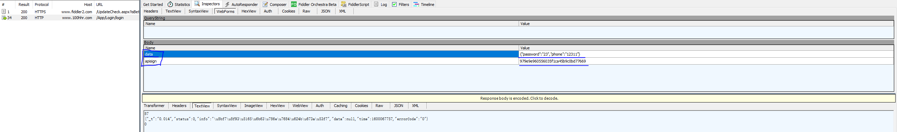
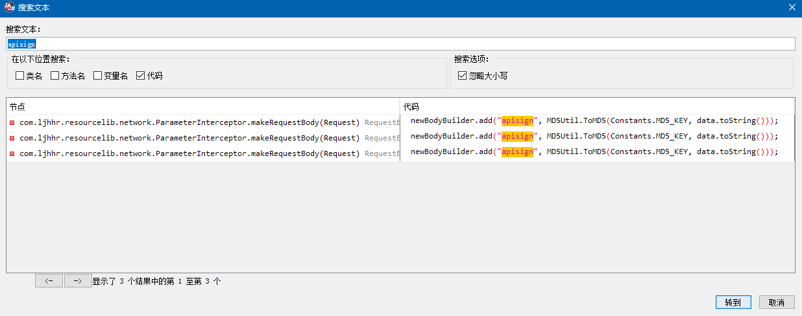

### 查看是否加固


没有壳。

### 抓取登录接口

使用 Fiddler，配置 https，Fiddler的使用请自行Google。

模拟器链接代理，记得还要安装Fiddler证书。

抓取接口如下：



可以看到，传递的参数有两个。

data 是一个 json，里面是我们输入的用户名与密码，MD，密码居然明文储存。

还有一个 apisign，这个其实是一个摘要算法，为了防止传输的信息被篡改。每个用户登录时计算出来的结果都不同，我们的目的就是要搞清楚它使用的什么摘要算法。


### 反编译apk

jadx的使用自行 Google。

我们使用jadx打开这个apk文件，搜索 apisign 这个字符串（为啥搜索这个，是一个经验之谈），你也可以找到登录界面，看按钮点击的时候调用了什么方法，是一样的。发现如下信息：



随便选一个，点进去，发现如下逻辑：

```java
                        newBodyBuilder.add("data", data.toString());
                        newBodyBuilder.add("apisign", MD5Util.ToMD5(Constants.MD5_KEY, data.toString()));
                        L.d("请求地址RequestUrl=====", oldUrl.url().toString());
                        L.d("请求参数Params=========", data.toString());
```

里面居然还有log信息。可以看到，apisign 是通过 MD5Util 这个类计算出来的，跟踪下去：

```java
    public static String ToMD5(String secretKey, String pstr) {
        // 这里将密钥加进去了，其实就是一个写死的字符串，Constants.MD5_KEY
        String pstr2 = secretKey + pstr;
        char[] hexDigits = {'0', '1', '2', '3', '4', '5', '6', '7', '8', '9', 'A', 'B', 'C', 'D', 'E', 'F'};
        try {
            MessageDigest md5Temp = MessageDigest.getInstance("MD5");
            md5Temp.update(pstr2.getBytes("UTF8"));
            // 这里的 j 没看到，是这个工具逆向不完全
            // 可以使用 jeb 查看还原的代码，会更加准确一点
            char[] str = new char[(j * 2)];
            int k = 0;
            for (byte byte0 : md5Temp.digest()) {
                int k2 = k + 1;
                str[k] = hexDigits[(byte0 >>> 4) & 15];
                k = k2 + 1;
                str[k2] = hexDigits[byte0 & 15];
            }
            return new String(str).toLowerCase();
        } catch (Exception e) {
            return null;
        }
    }

```

是一个很简单的 MD5 算法，但是它下面还有一串代码，这串代码是做什么的呢？其实作用是将 byte 数组转成 16进制字符串。

从hexDigits，数组的长度*2，for循环的无符号右移，都可以看出，是准备将一个 byte 转成 2个 char 字符，字符来源于 hexDigits。

那么，到这里 apisign 基本就可以确定了，就是一个普通的 md5 摘要。


### 验证

我们拿出MD5计算工具，计算一下：


可以看到，计算出来的结果与 apisign 的值是一样的。

如果不一样的话，就说明那个 byte 转 char 的 for 循环里面搞了什么鬼，不过这里没有，毕竟这是第一课。

以后会看到加固，so，反调试，反代理之类的。