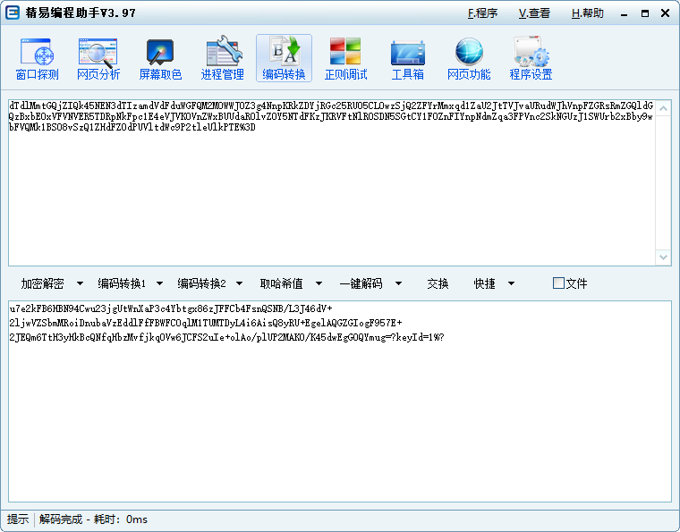
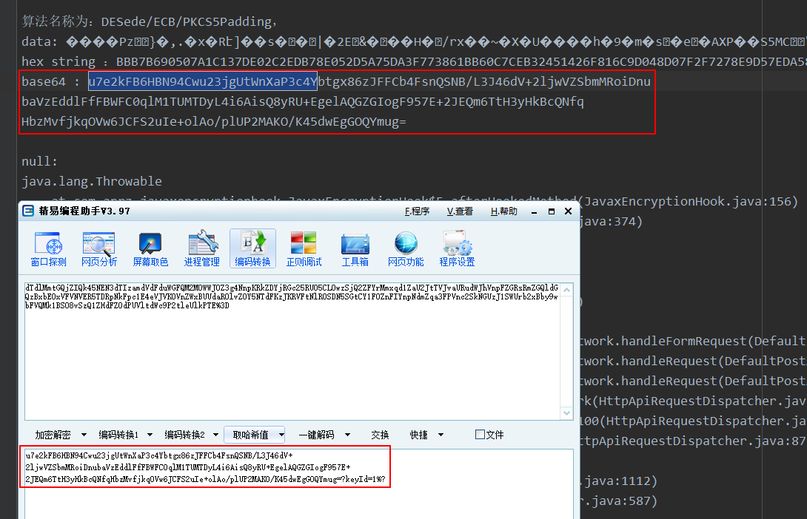

### 抓取请求

```
POST http://passport.zcool.com.cn/login_jsonp_active.do HTTP/1.1
Content-Type: application/x-www-form-urlencoded; charset=utf-8
Content-Length: 302
Host: passport.zcool.com.cn
Connection: Keep-Alive
Accept-Encoding: gzip
User-Agent: okhttp/3.1.2

key=dTdlMmtGQjZIQk45NEN3dTIzamdVdFduWGFQM2M0WWJ0Z3g4NnpKRkZDYjRGc25RU05CL0wzSjQ2ZFYrMmxqd1ZaU2JtTVJvaURudWJhVnpFZGRsRmZGQldGQzBxbE0xVFVNVER5TDRpNkFpc1E4eVJVK0VnZWxBUUdaR0lvZ0Y5NTdFKzJKRVFtNlR0SDN5SGtCY1FOZnFIYnpNdmZqa3FPVnc2SkNGUzJ1SWUrb2xBby9wbFVQMk1BS08vSzQ1ZHdFZ0dPUVltdWc9P2tleUlkPTE%3D&app=android
```

### 查看log

key显然是一个 base64 编码，我们搜索前一段，因为编码的结果会换行，搜索后，发现搜不到，有3种可能：

- 加密在 so 层
- 不是使用的 java 提供的加密算法
- 是使用的 java 提供的加密算法，但是对结果做了一定处理

这个时候，我们可以尝试去搜索一下我们的账号与密码，如果你打印了一些 key 的参数的，当然，我的那个模块是没有做这个打印的，你可以自行添加这些功能，我是懒得写的。其实，除了hook加密库，我们还可以hook请求库，这样更加彻底，当然请求库很多。

这里可以这样做，因为结果是 base64 编码，所以我们将他解密一下，再搜索：



搜索前面的这一串：



可以看到，是一模一样的，这样我们就可以去找它的源码所在位置了。

### 源码

```java
    public String encrypt(Map params) {
        Objects.requireNotNull(params);
        StringBuffer sb = new StringBuffer();
        String json = new Gson().toJson((Object) params);
        AxxLog.d("EncryptManager encrypt>>>" + json);
        sb.append(DESedeCoder.encode(json, KEYS.get("1"))).append("?keyId=").append("1");
        try {
            String sbString = sb.toString();
            AxxLog.d("EncryptManager encrypt>>>" + sbString);
            return URLEncoder.encode(encryptBASE64(sbString.getBytes("UTF-8")), "UTF-8");
        } catch (UnsupportedEncodingException e) {
            throw new RuntimeException(e);
        }
    }

```

可以看到，它是将json进行了encode，然后再拼接了一个 ?keyId=1，然后再base64。

可以根据上下文得到其密钥，这里就不说了，很简单。

