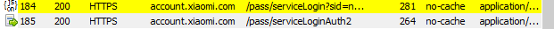
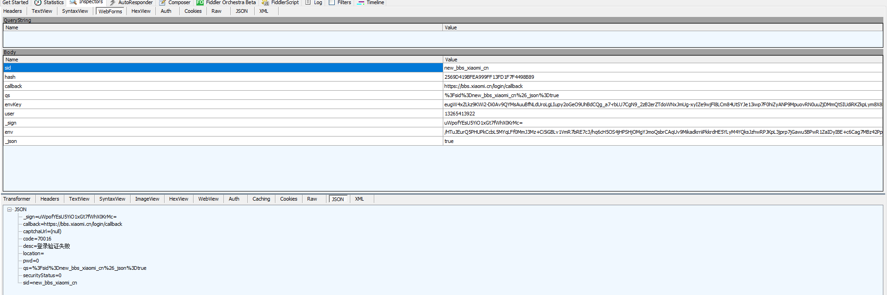
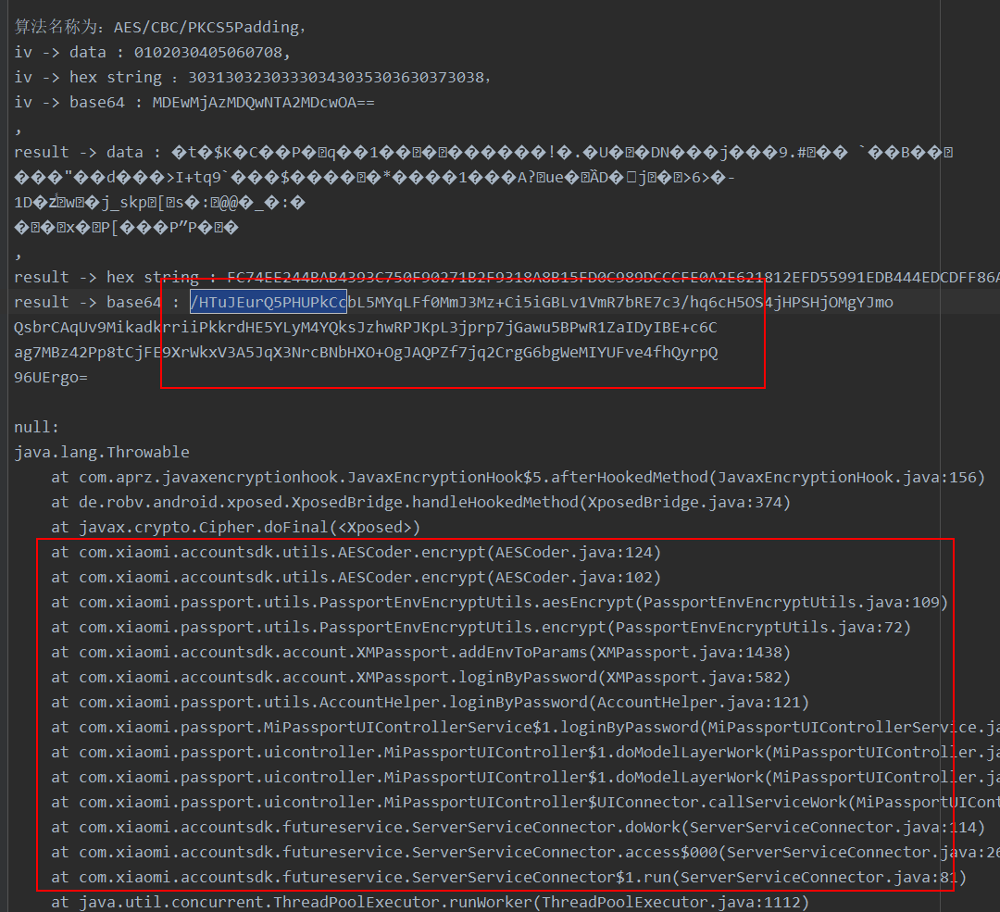
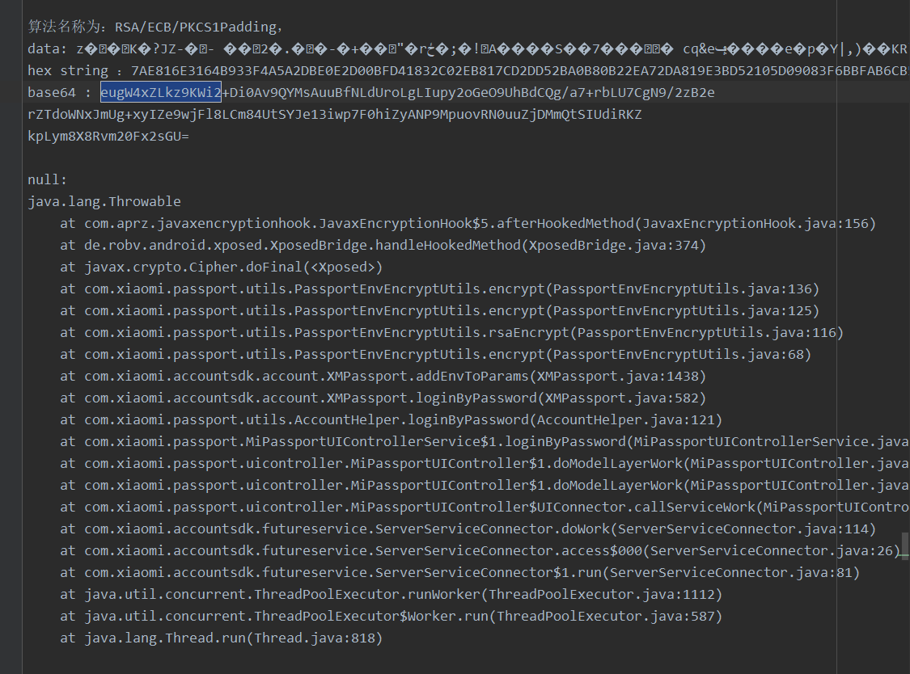

### 抓取请求





注意到这里与以前不一样的地方，当我们点击登录按钮的时候，它发送了两个请求，可以猜一下，它为啥要发两个请求。

我们搜索一下第二个请求的 _sign 参数值，按照以前的套路，我们会以为它是计算出来的，但是实际上不是，它是第一个请求返回过来的。所以当你逆向的时候，发现搞不定某个参数，记得在请求里面搜索一下，看是不是之前的请求返回的。

还有一个地方需要注意：参数里面有两个key是有关系的！env 与 envKey。这会让你想到什么呢？这其实是一个套路。

envKey 显然是一个密钥，它一般是使用 RSA 算法加密过了的。那么这个密钥是用来干啥的呢？这个密钥就是用来将传递的数据加密的。过程如下：

首先，客户端加密使用 DES 等算法（因为 env 数据一般较长，所以采用 DES/3DES/AES 等对称算法，RSA 加密较慢），然后随机出来一个密钥，这个密钥是用来加密数据，与服务器通信，但是我们不能明文传递，所以需要将它使用  RSA 加密后传递给后台，也就是这里的 envKey，我们传递的数据就是 env。

再说 hash，如果你常使用同一个密码，那么你就能立刻认出来，hash其实就是密码的 md5 值，所以建议你设置一个常用的密码，比如：qwe123123，然后记住它的 md5 的前后几位，这样当你看到 md5 的时候，就能立刻反应过来它是你的密码。

其他的基本是账号与固定值，没啥好说的了。下面具体分析 env 与 envKey。


### 先看 env 

搜索日志：




### 查看源码

```java
    private static String aesEncrypt(String str, SecretKey secretKey) throws EncryptException {
        try {
            return new AESCoder(secretKey.getEncoded()).encrypt(str);
        } catch (CipherException e) {
            throw new EncryptException(e);
        }
    }
```

看密钥是如何生成的：

```java
    private static SecretKey generateSymmetricKey() throws EncryptException {
        try {
            KeyGenerator instance = KeyGenerator.getInstance(SYMMETRIC_ALGORITHM);
            instance.init(new SecureRandom());
            return instance.generateKey();
        } catch (NoSuchAlgorithmException e) {
            throw new EncryptException(e);
        }
    }
```

这里是直接随机生成了一个密钥。这里就验证了我们上面所说的套路。

看看 AESCoder 内部：

```java
    public byte[] encrypt(byte[] bArr) throws CipherException {
        try {
            Cipher instance = Cipher.getInstance("AES/CBC/PKCS5Padding");
            instance.init(1, this.keySpec, new IvParameterSpec(getInitalVector()));
            return instance.doFinal(bArr);
        } catch (Exception e) {
            throw new CipherException("fail to encrypt by aescoder", e);
        }
    }
```

iv 向量是：

```java
    public byte[] getInitalVector() {
        return "0102030405060708".getBytes();
    }
```

我们看 envKey，看看它是如何将密钥进行加密的。

搜索 envKey，它的编码如下：

```
eugW4xZLkz9KWi2-Di0Av9QYMsAuuBfNLdUroLgLIupy2oGeO9UhBdCQg_a7-rbLU7CgN9_2zB2erZTdoWNxJmUg-xyIZe9wjFl8LCm84UtSYJe13iwp7F0hiZyANP9MpuovRN0uuZjDMmQtSIUdiRKZkpLym8X8Rvm20Fx2sGU=
```

注意这个 base64 便阿门，它里面没有 + ，而是有 - 号，这是 base64 的变种，因为 += 都是用来填充的，那么使用 - 也可以填充。

所以搜索的时候记得不要包含 -，或者将 - 替换为 + 再搜索，因为我们xposed hook 模块使用的 base64 编码是 + 号。



加密代码，在同一个位置。

```java

    private static byte[] encrypt(byte[] bArr, Key key, String str) throws EncryptException {
        try {
            Cipher instance = Cipher.getInstance(str);
            instance.init(1, key);
            return instance.doFinal(bArr);
        } catch (IllegalBlockSizeException e) {
            throw new EncryptException(e);
        } catch (BadPaddingException e2) {
            throw new EncryptException(e2);
        } catch (NoSuchAlgorithmException e3) {
            throw new EncryptException(e3);
        } catch (NoSuchPaddingException e4) {
            throw new EncryptException(e4);
        } catch (InvalidKeyException e5) {
            throw new EncryptException(e5);
        }
    }

```

key 是公钥，值为：

```java
    private static String rsaPublicKeyStr = "-----BEGIN CERTIFICATE-----\nMIICDzCCAXigAwIBAgIEWBw0IzANBgkqhkiG9w0BAQUFADBMMQswCQYDVQQGEwJD\nTjEPMA0GA1UEChMGeGlhb21pMQ8wDQYDVQQLEwZ4aWFvbWkxGzAZBgNVBAMTEmFj\nY291bnQueGlhb21pLmNvbTAeFw0xNjExMDQwNzA5MjNaFw0xNzExMDQwNzA5MjNa\nMEwxCzAJBgNVBAYTAkNOMQ8wDQYDVQQKEwZ4aWFvbWkxDzANBgNVBAsTBnhpYW9t\naTEbMBkGA1UEAxMSYWNjb3VudC54aWFvbWkuY29tMIGfMA0GCSqGSIb3DQEBAQUA\nA4GNADCBiQKBgQCHcPEm9Wo8/LWHL8mohOV5YalTgZLzng+nWCEkIRP//6GohYlI\nh3dvGpueJvQ3Sany/3dLx0x6MQKA34NxRyoO37R/LgPZUfe6eWzHQeColBBHxTED\nbCqDh46Gv5vogjqHRl4+q2WGCmZOIfmPjNHQWG8sMIZyTqFCLc6gk9vSewIDAQAB\nMA0GCSqGSIb3DQEBBQUAA4GBAHaPnscaxSPh0N0Z5OgQ6PcWr5uYPLMweatYGZRH\nSFxwSqYXpqIowuRxmrBj+oE5rG5rzFCtNjCBoeMVy/7JXZr9Juaw9NCWaTaqrmIV\nP4nK/0kizCvkx3088OOCGextGeZUC9/PCbVUEcRvGLwSrvgqiC1KG4ufeIdQWBaJ\n8ZlG\n-----END CERTIFICATE-----\n";
```

由此，加密流程就全部搞定了。

还有一个小技巧，假设我们每次随机出来的密钥都是一样的，那么是不是可以省略逆向 envKey 这个流程呢？显然是的，我们可以自己随机一个密钥出来，然后之后的全部请求全用这个一个加密，envKey 写死就好了。

ras加密（RSA/ECB/PKCS1Padding）的结果每次不一样，所以也没法验证，反正流程是 OK 的就好了。