### 抓取登录请求

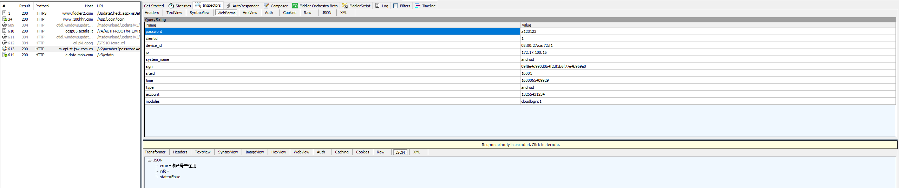

参数都挺好懂，只有 sign 是根据传递的信息计算出来的，这个是我们需要搞清楚的。


### 查找 sign

我们按照以前的方法，先查找 sign，发现它是一个常量：

```java
public static final String MODULE_SIGN = "sign";
```

搜索 MODULE_SIGN，发现使用的地方非常多：

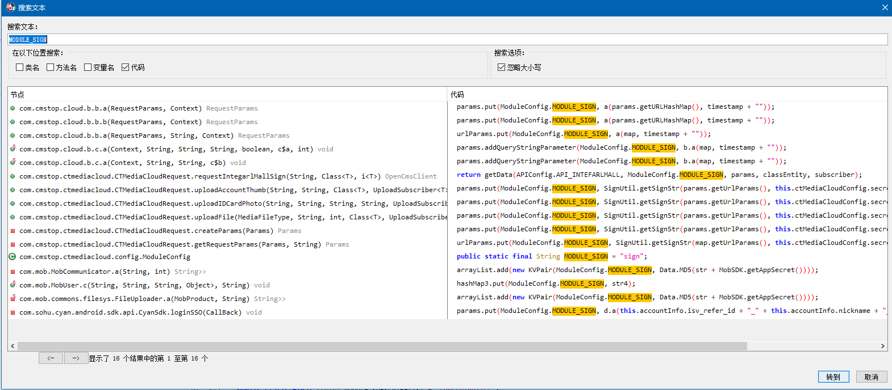

那么，问题来了，到底哪个地方才是真正登录调用的地方呢？

我们可以先对比参数，一个一个点击进去，看看源码上下文的代码，比如看第一个地方：

```java
    public RequestParams a(RequestParams params, Context context) {
        params.put("device_id", PhoneInfoUtils.getDeviceId(context));
        params.put("clientid", "1");
        params.put(IjkMediaPlayer.OnNativeInvokeListener.ARG_IP, AppUtil.getLocalIP());
        long timestamp = System.currentTimeMillis();
        params.put("siteid", "10001");
        params.put("system_name", "android");
        params.put("type", "android");
        params.put(ModuleConfig.MODULE_SIGN, a(params.getURLHashMap(), timestamp + ""));
        params.put("time", timestamp + "");
        return params;
    }
```

发现，这个还是比较像的，其他的地方还有上传啥的，显然就不是了，但是是不是这个地方，还有待考证。

然后打开JEB，下个断点，调试一下看看是不是这个地方。

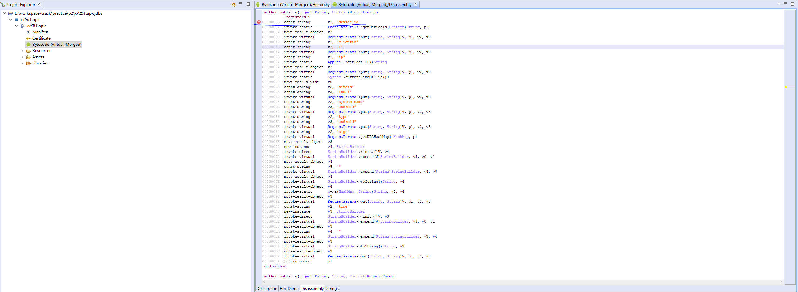

启动调试，发现进程不可调试：

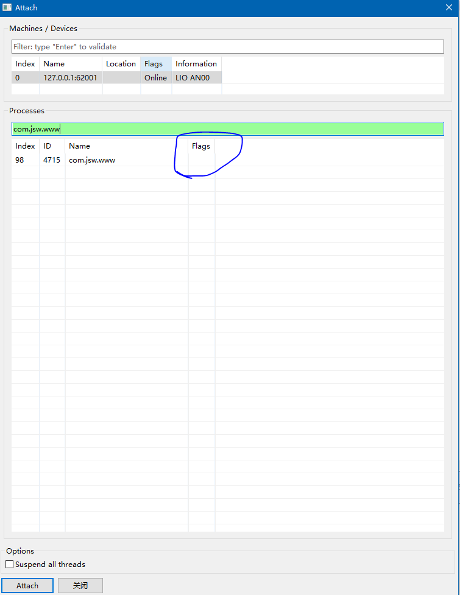

这是因为如果需要调试android 的程序，以下两个条件满足一个就行。第一是apk的配置文件内的AndroidManifest.xml的 android:debuggable=”true”，第二就是/default.prop中ro.debuggable=1。

我们可以查看一下 debuggable的值：

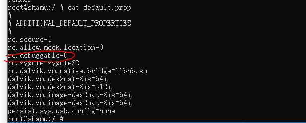


这里我们不改 xml 里面的值，否则还要重新签名，不然装不上去（雷电模拟器倒是不校验签名，挺方便），麻烦，只改 prop 的值，有个 mprop 工具，但是只对手机有效，这里是模拟器，需要安装 xposed 工具，然后安装 BDOpener 模块（安装过程自行Google，直接往模拟器托就好了）。

安装完成之后，如图：

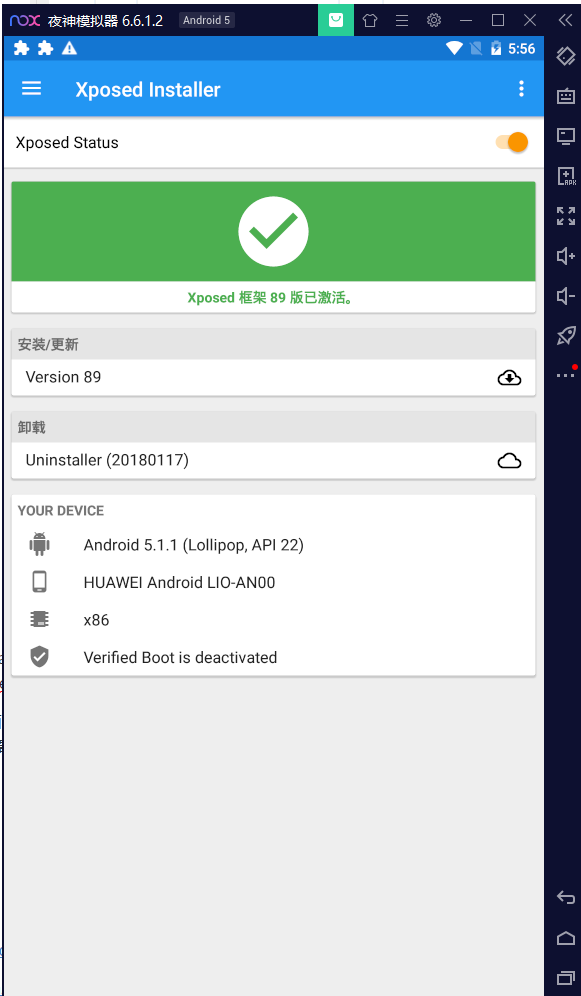

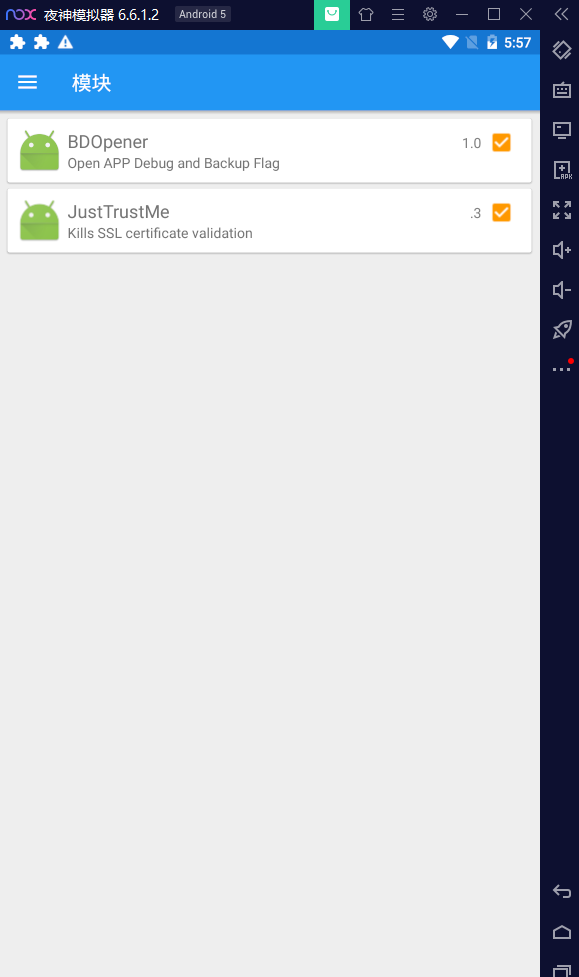

勾选上了之后不会立即生效，需要重启模拟器，重启模拟器后再使用JEB调试，发现可以调试了：

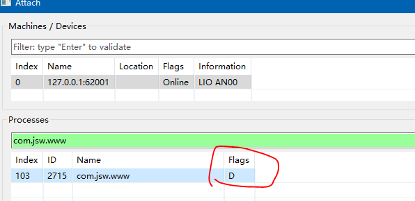


如果双击后，发现报出无法调试的错误，可能是模拟器adb端口不对，adb connect 一下。确定端口没问题的话，多点几次，毕竟是盗版，还想怎样！

点击登录，发现进入了调试模式，那么我们的断点位置没错！！！调试窗口如下：

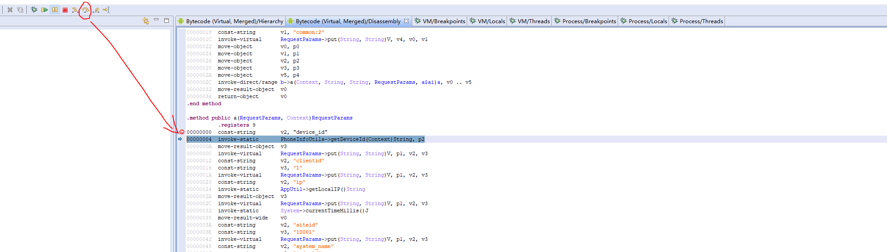

step over 一下，可以查看 v2 寄存器的值。

继续走两步，查看 v3 的值（在 VM/Locals tab下）：

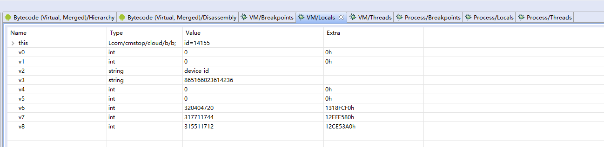

需要将 v3 的 type 改成 string，这样才能看到值，可以看到我们的 device_id 是多少，与模拟器的是一致的。

继续往下调试，可以看到其他变量的值，就不贴图了。

直接到 sign 处，右键 Decompile，查看反编译后的java代码：

```java
    public RequestParams a(RequestParams arg7, Context arg8) {
        arg7.put("device_id", PhoneInfoUtils.getDeviceId(arg8));
        arg7.put("clientid", "1");
        arg7.put("ip", AppUtil.getLocalIP());
        long v0 = System.currentTimeMillis();
        arg7.put("siteid", "10001");
        arg7.put("system_name", "android");
        arg7.put("type", "android");
        arg7.put("sign", b.a(arg7.getURLHashMap(), v0 + ""));
        arg7.put("time", v0 + "");
        return arg7;
    }
```

sign的值，由 b.a 这个函数得到，第一个参数是一个 hashmap，第二个参数是时间戳（string类型）。

转到调试tab页面，走到 b.a 这一行：

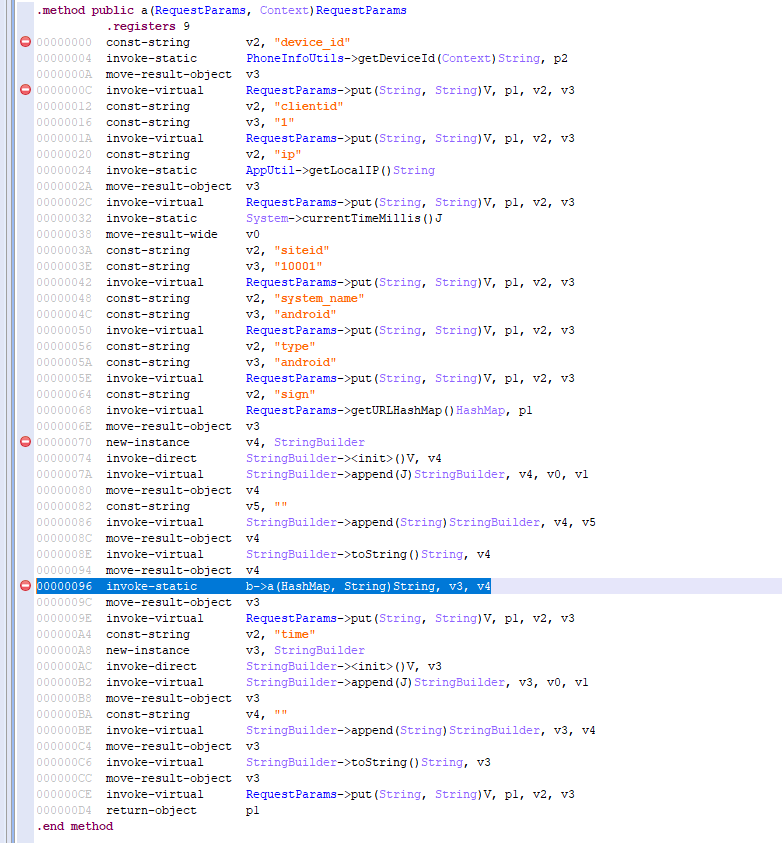

跳进去，就可以知道它调用的是哪个函数了（也可以从java代码页面，直接调过来，按快捷键（双击方法名）就行）：

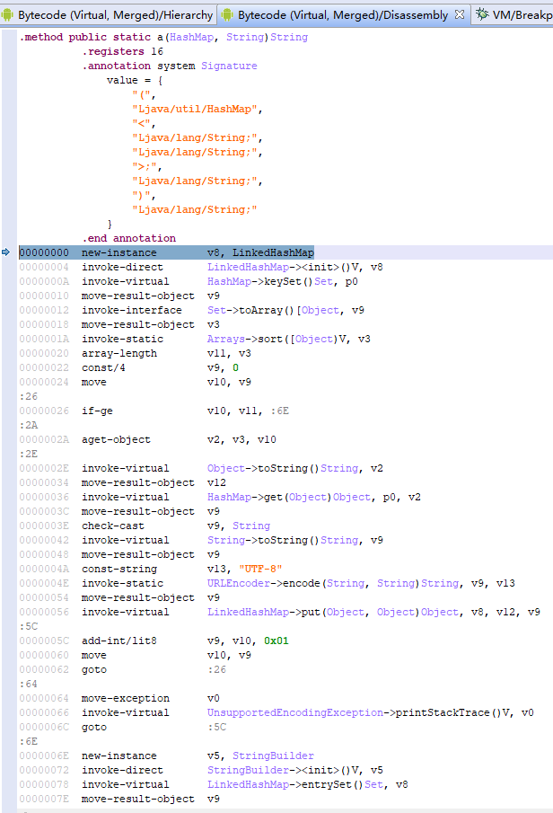

再右键反编译一下，就可以看到对应的java代码了：

```java
    public static String a(HashMap arg14, String arg15) {
        // LinkedHashMap 是有序的
        LinkedHashMap v8 = new LinkedHashMap();
        // key 的集合
        Object[] v3 = arg14.keySet().toArray();
        // 将 map 中的 key 排序，因为 map 无序，这样摘要也会不同。
        Arrays.sort(v3);
        int v11 = v3.length;
        int v10;
        // for 循环，i++
        for(v10 = 0; v10 < v11; ++v10) {
            // 取 set 中的元素
            Object v2 = v3[v10];
            try {
                // 存放集合，key是原来的key，value是经过url编码了的
                v8.put(v2.toString(), URLEncoder.encode(arg14.get(v2).toString(), "UTF-8"));
            }
            catch(UnsupportedEncodingException v0) {
                v0.printStackTrace();
            }
        }

        StringBuilder v5 = new StringBuilder();
        Iterator v10_1 = v8.entrySet().iterator();
        // 将 map 中的键值对拼接成一个 string
        // key2=value1&key2=value2 这样子
        while(v10_1.hasNext()) {
            Object v1 = v10_1.next();
            if(v5.length() > 0) {
                v5.append("&");
            }

            v5.append(((Map$Entry)v1).getKey());
            v5.append("=");
            v5.append(((Map$Entry)v1).getValue());
        }

        // 替换 string 中的一些字符
        String v9 = v5.toString().replace("*", "%2A").replace("%7E", "~").replace("+", "%20");
        crack.log(v9);
        // 进行 md5
        String v6 = MD5.md5(v9);
        crack.log(v6);
        // 拼接：md5 + 固定字符串 + 时间戳
        v9 = v6 + "1fa50ba25ed527f3fd1eb9467686f2bb" + arg15;
        crack.log(v9);
        // 再次 md5，这个就是我们的 sign
        String v4 = MD5.md5(v9);
        crack.log(v4);
        return v4;
    }
```

这个代码还是比较接近写出来的代码的，并不难。上面代码中的 MD5.md5 与上一课中的算法是一样的，就不说了。

我们可以写个对应的 java 程序（或者直接将它copy出来使用），这样登录接口，我们就破解了，使用脚本也可以登录了。

还原后的  java 代码如下：

```java
    public static void main(String[] args) {
        // password	a123123
        //clientid	1
        //device_id	08:00:27:ca:72:f1
        //ip	172.17.100.15
        //system_name	android
        //sign	09f8e4d990d0b4f2df3b6f77e4b959a0
        //siteid	10001
        //time	1600065409929
        //type	android
        //account	13265431234
        //modules	cloudlogin:1

        HashMap<String, String> map = new HashMap<>();
        map.put("password", "a123123");
        map.put("clientid", "1");
        map.put("device_id", "08:00:27:ca:72:f1");
        map.put("ip", "172.17.100.15");
        map.put("system_name", "android");
        map.put("siteid", "10001");
//        map.put("time", "1600065409929");
        map.put("type", "android");
        map.put("account", "13265431234");
        map.put("modules", "cloudlogin:1");

        System.out.println(sign(map, "1600065409929" ));
    }

    public static String sign(HashMap<String, String> params, String arg15) {
        LinkedHashMap<String, Object> temp = new LinkedHashMap<>();
        String[] keys = params.keySet().toArray(new String[0]);
        Arrays.sort(keys);
        for (String key : keys) {
            try {
                temp.put(key, URLEncoder.encode(params.get(key), "UTF-8"));
            } catch (UnsupportedEncodingException e) {
                e.printStackTrace();
            }
        }

        StringBuilder sb = new StringBuilder();
        for (Map.Entry<String, Object> entry : temp.entrySet()) {
            if (sb.length() > 0) {
                sb.append("&");
            }
            sb.append(entry.getKey()).append("=").append(entry.getValue());
        }

        String replace = sb.toString().replace("*", "%2A")
                .replace("%7E", "~")
                .replace("+", "%20");
        String paramsMD5 = md5(replace);
        replace = paramsMD5 + "1fa50ba25ed527f3fd1eb9467686f2bb" + arg15;
        return md5(replace);
    }

    private static String md5(String md5) {
        try {
            MessageDigest m = MessageDigest.getInstance("MD5");
            m.update(md5.getBytes(StandardCharsets.UTF_8));
            byte[] s = m.digest();
            StringBuilder result = new StringBuilder();
            for (byte b : s) {
                result.append(Integer.toHexString((0x000000FF & b) | 0xFFFFFF00).substring(6));
            }
            return result.toString();
        } catch (NoSuchAlgorithmException e) {
            throw new RuntimeException("没有这个md5算法！");
        }
    }

```

运行程序，发现，sign 的值与抓取到的值是一样的。这样就破解成功了。最后我们写脚本的时候，记得添加时间戳就好了。


### 以德服人

上面，我们搜索 sign 发现有很多地方匹配，如果你不想一个一个试的话，可以查看当前 activity 的名称，然后搜素这个类：

```cmd
adb shell "dumpsys activity | grep "mFocusedActivity""
```

输出：mFocusedActivity: ActivityRecord{a412f9e u0 com.jsw.www/com.cmstop.cloud.activities.LoginCloudActivity t2}

所以，当前 activity 是 LoginCloudActivity 。然后搜索这个类：

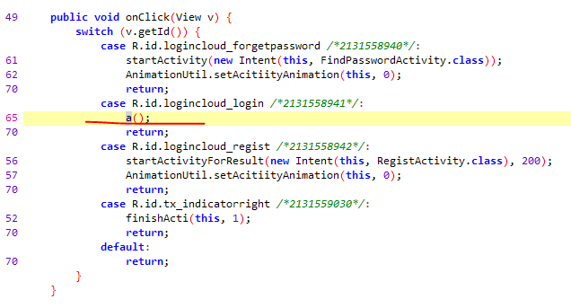

登录的时候，调用了 a 方法，继续追踪下去：

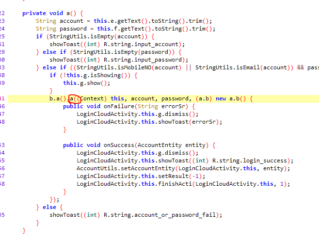

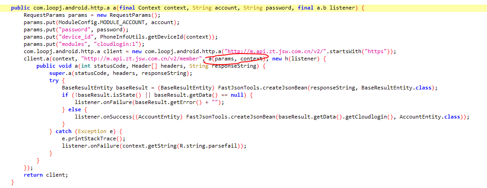

这个 a 方法，就是我们的获取 sign 的方法了。这里其实考验的是对 Android 开发的一个熟悉程度，我看起来还是很容易的，你接触的三方库越多，看起来就越简单。

### 添加log

有时候实在是无法调试，或者改了 type 类型的时候直接crash了，那么就需要log来帮助我们理解代码中变量的意义了。

添加 log 实际上就是 smali 插桩，知道字节码插桩的就更容易理解了。

smali插桩需要手动插桩，不过好在内容比较简单：

```smali
输出byte
invoke-static {vx}, Lcrack;->convertByteArrayToString([B)Ljava/lang/String;

输出string
invoke-static {vx}, Lcrack;->log(Ljava/lang/String;)V
```

vx 是你想要输出的寄存器。

Lcrack;->log 是调用一个叫 crack 类的 log 方法。

在你想要输出log的位置直接粘上去就好了，因为我们调用的是静态方法，所以还不用考虑变量问题，是不是很简单呢：

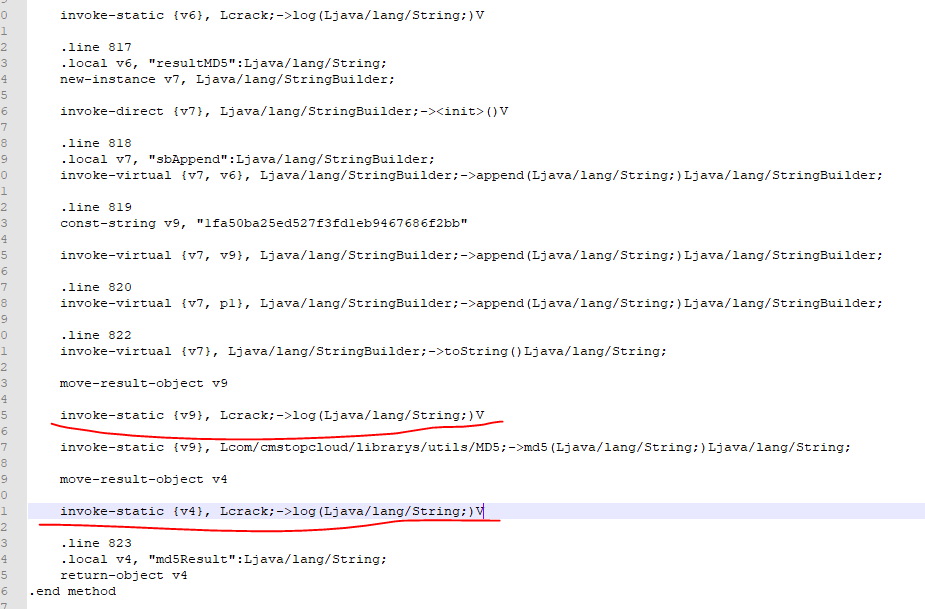

因为用到了 crack 这个类，显然，我们需要往 apk 里面添加这个类（类文件已经提供好了）。过程如下：

先使用工具将 class.dex 文件反编译 ：

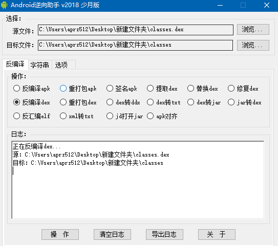

然后在反编译出来的最外层添加 crack.smali 就好了，这里的apk是已经添加好了的，建议自己添加log试试：

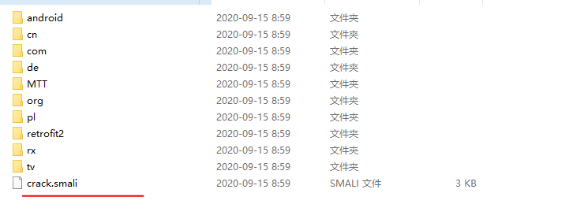

建议自己写一个更加通用的类，打印map什么的，写个apk，将smali抠出来自己使用。

放好了之后，就重新打包成 dex，放到原来的 apk 里面，需要重新签名，但是雷电模拟器不校验签名，所以跳过。

再次运行就能看到 log 咯。上面是使用notepad++来添加log，比较蛋疼，我们使用 Android killer 来演示一下，添加 log 的过程。

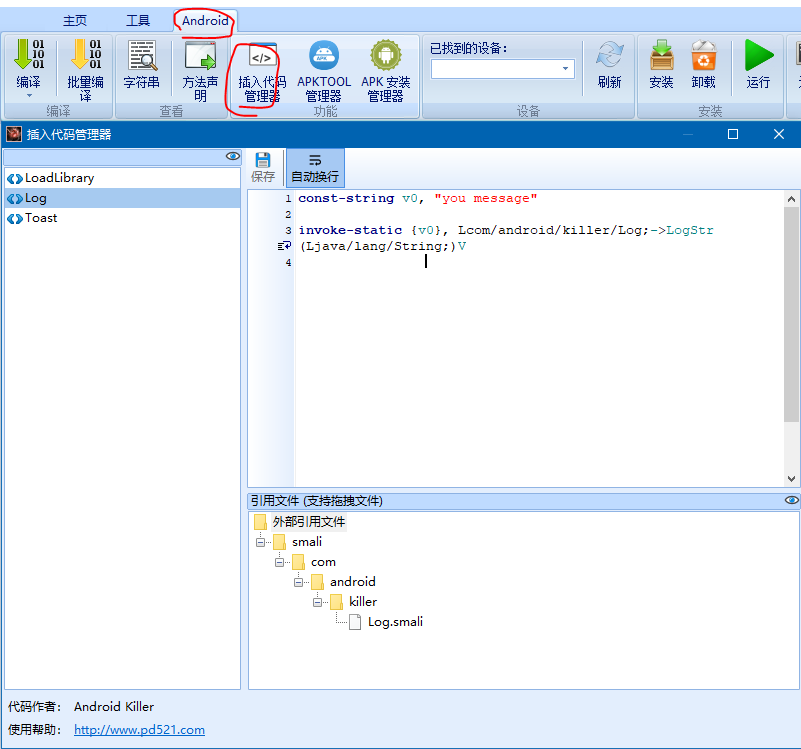

可以看到，Android killer 里面已经提供了一个默认的 log 输出方法。他也支持扩展，非常牛逼。

可以在这里右键添加自己的log，然后把文件也添加进去，里面的代码自己编辑。

然后转到smali代码，右键插入代码即可搞定。

编译，安装，查看log（需要用手机号登录，不然似乎走的别的逻辑，懒得分析了）：

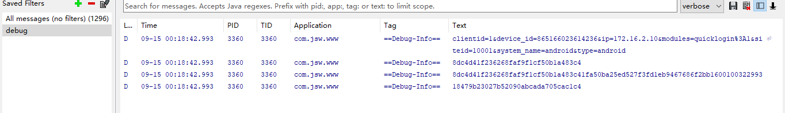


### 参考文档

https://blog.csdn.net/qq_36317441/article/details/89494686

https://bbs.pediy.com/thread-246081.htm

https://security.tencent.com/index.php/opensource/detail/17

https://github.com/wpvsyou/mprop

