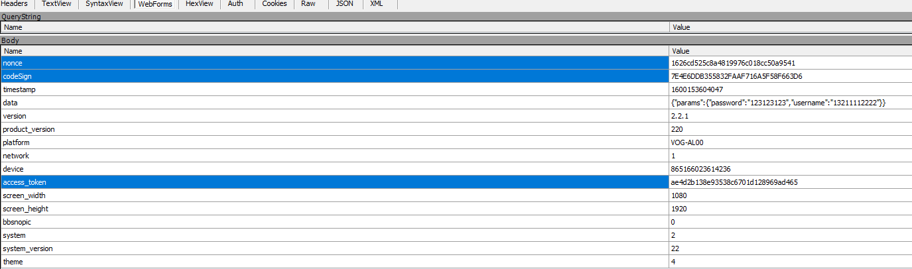
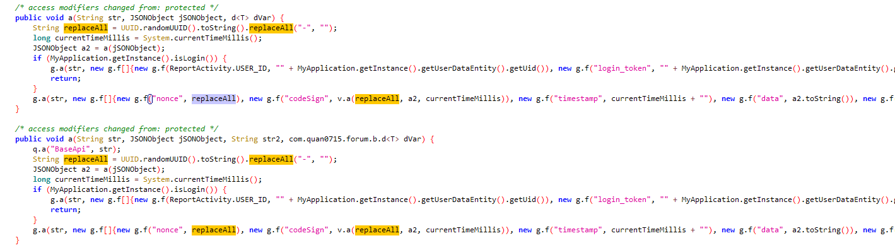

### 登录接口



有3个参数是我们需要搞定的，其他的都是明文，很好伪造。

### 查看代码

#### nonce



这个 g.f 对象查看源码其实就是一个 Pair 一样的东西，可以理解未储存一个 key，一个value，所以这个 nonce 的值，就是 replaceAll。

而 replaceAll 的值是 UUID 随机出来的，不过是替换了 "-" 这个符号，所以这个参数就搞个随机数就ok了。


#### codeSign

```java
new g.f("codeSign", v.a(replaceAll, a2, currentTimeMillis))
```

我们需要知道这个里面的 a2 是啥？查看 a2 的由来

```java
JSONObject a2 = a(jSONObject);

// 调用了这个方法
public JSONObject a(JSONObject jSONObject) {
    JSONObject jSONObject2 = new JSONObject();
    try {
        jSONObject2.put("params", (Object) jSONObject);
    } catch (Exception e) {
        e.printStackTrace();
    }
    return jSONObject2;
}
```

所以，需要知道 jSONObject 里面是啥！一个方法是 log ，一个是动态调试，这里就直接看代码吧，挺简单的，从登录按钮的逻辑看起。

登录界面是 LoginActivity，但是里面有两个 fragment，登录 fragment 是 PasswordLoginFragment。

按着登录逻辑走下去，发现如下方法：

```java
    public void a(String str, String str2, d<T> dVar) {
        JSONObject jSONObject = new JSONObject();
        try {
            jSONObject.put("username", (Object) str);
            jSONObject.put("password", (Object) str2);
        } catch (Exception e) {
            e.printStackTrace();
        }
        a(com.quan0715.forum.b.b.i, jSONObject, dVar);
    }
```

然后就到了我们最上面的方法里面，所以，那个 jSONObject 里面就是用户名与密码。

最终，a2 的结果就是 {"params":{"password":"123123123","username":"13211112222"}}，其实就是接口里面的 data  参数。看上面的截图也能看得到，data 就是 a2.toString()，所以其实也不用分析，只要你眼睛足够好使。

a2 搞定了，看看 v.a 这个方法做了啥！

```java
    public static String a(String str, JSONObject jSONObject, long j) {
        return r.a(jSONObject.toString() + str + a() + j).toUpperCase();
    }
```

str 是 uuid。

jSONObject 是 {"params":{"password":"123123123","username":"13211112222"}}。

j 是时间戳。

再继续深入，就很简单了，a() 是先读取了一个字符串：forum_key，它的值是 94ac5cfb69e87bd7。又读取了一个字符串 upload_key，它的值是： 860f50db3569e448。将这两个字符串拼起来，做个倒序。结果是：844e9653bd05f0687db78e96bfc5ca49。

然后看 r.a 方法，就是一个 md5，所以最终 codeSign 的值为：

```
md5( {"params":{"password":"123123123","username":"13211112222"}} + uuid + 844e9653bd05f0687db78e96bfc5ca49 + 时间戳)
```

计算一下：


发现，果然与抓取的值是一样的，不过要转成大写。

#### access_token

```java
new g.f("access_token", "" + a.h)
```

看起来是直接取的一个变量值。

```java
    static {
        String str = f + Build.PRODUCT + MyApplication.getNetworkType() + MyApplication.getDeviceId();
        h = r.a(str);
    }
```

f 是 versionName：2.2.1

Build.PRODUCT 是产品型号，比如小米10等，看接口里面，我们的是：VOG-AL00

MyApplication.getNetworkType() 网络类型，接口里面是 1，有兴趣的可以戳进去看看app源码，取值可以取 0 1 2 3，1 代表 wifi。

MyApplication.getDeviceId() 设备id，接口里面是 865166023614236。

r.a 上面说过了，是 md5，最终结果为：

```
md5(2.2.1VOG-AL001865166023614236)
```

显然，结果也是一样的。