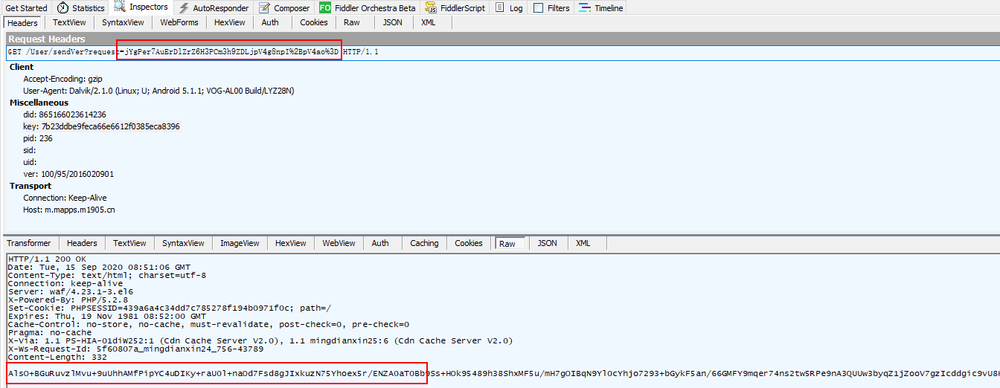

### 抓取请求



可以看到，上面请求url 与返回的结果都被加密了。

不过，这里的加密比较简单，刚开始看到这不要慌，细看一下，发现加密串里面的特殊字符只有 / 与 +，极有可能是 base64 加密，这就跟明文差不多了。

### 查看代码

由于参数被加密了，所以只能搜索请求的 url 了。

```java
    public void a(String str, int i) {
        StringBuilder sb = new StringBuilder();
        sb.append("http://m.mapps.m1905.cn/User/sendVer");
        sb.append("?request=");
        try {
            sb.append(URLEncoder.encode(aay.b("mobile=" + str + "&templateid=" + i), "UTF-8"));

```

可以看到参数是 mobile 与 templateid，mobile 可能是手机号，templateid 未知，查看调用的地方，发现注册传 1，更改手机号传 2。

跟进 aay.b 方法：

```java
    public static String b(String str) {
        try {
            SecretKey generateSecret = SecretKeyFactory.getInstance(MCRYPT_TRIPLEDES).generateSecret(new DESedeKeySpec(key.getBytes()));
            Cipher instance = Cipher.getInstance(TRANSFORMATION);
            instance.init(1, generateSecret, new IvParameterSpec(iv.getBytes()));
            return aau.a(instance.doFinal(str.getBytes()));
        } catch (Exception e) {
            return "";
        }
    }
```

这里是使用 DESede/CBC/PKCS5Padding 来进行加密。密钥是 iufles8787rewjk1qkq9dj76。IvParameterSpec 是初始化一个向量，作用应该是加密更难破解吧，值是 vs0ld7w3。

将加密算法从 jadx 里面 copy出来之后，发现结果不对，看代码不知道哪里出了问题，只能加log或者调试了。调试时发现没有问题，实在没办法只能将 jadx 与 jeb 反编译的代码对比，发现 jadx 反编译出来的代码是有问题的，算法不对，将 jeb 里面的代码 copy 出来，改吧改吧就好了。

```
加密前的值：mobile=13265413911&templateid=1
加密后的值：jYgPer7AuErDlZrZ6H3PCm3h9ZDLjpV4g8npI+pV4ao=
进行 url 编码后的值：jYgPer7AuErDlZrZ6H3PCm3h9ZDLjpV4g8npI%2BpV4ao%3D
```

解码反过来就好了。

对请求进行解密试试，得出结果：

```json
{"res":{"result":600,"did":"865166023614236","sid":"","uid":"","ser_time":1600159866,"message":"\u53d1\u9001\u9891\u7e41\uff0c\u8bf7\u7a0d\u540e\u91cd\u8bd5"},"message":"\u53d1\u9001\u9891\u7e41\uff0c\u8bf7\u7a0d\u540e\u91cd\u8bd5","data":[]}
```

这是 unicode，转中文如下：


基本上，加解密就搞完了，当然这个app里面不止一套，还有其他的。

### 小技巧

如果你想用脚本来自动注册的话，会发现有一个问题。发送注册请求的时候，会提示网络繁忙，其实就是你的请求不符合正常app的行为，因为app已经来是先到推荐页面，所以会发送推荐请求，然后再切到注册页面，你的请求才会有效，所以你还需要先发送推荐请求才行。是因为 did 这个参数，应该是推荐请求传递了这个参数，然后注册的时候校验了这个参数。

所以，我们使用 Fiddler 来抓取请求的时候，app打开之后，最好将请求全记录下来，有时候你不知道哪个请求是必要的前置条件。

当你抓取app的数据时，遇到类似的情况，可以往这方面考虑。

该请求有个头部“X-BlueWare-Transction-Orgion”的由来也可以研究一下，还挺有意思的，它是md5值，是由某些参数加一个随机数拼接起来后，再 md5，但是仔细看一下我们的请求，它有发送随机数吗？实际上是没有的，也就是说服务器是没法校验这个md5是否正确的，所以，我们随便搞一个传过去就好了。