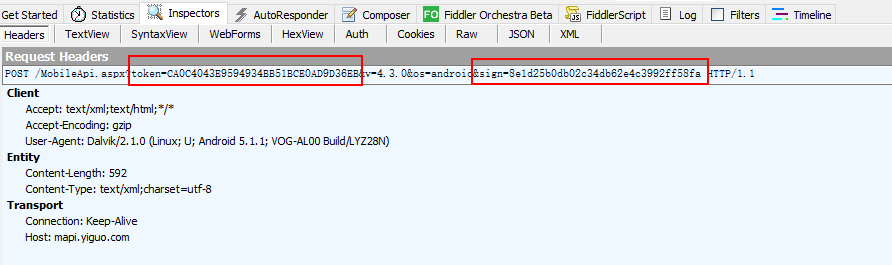
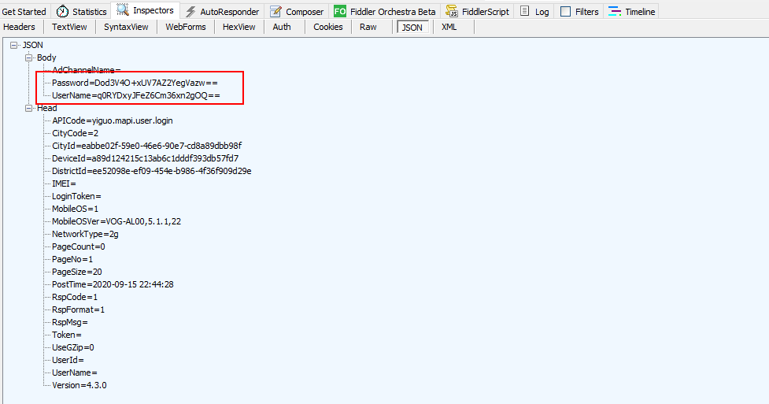

### 说明

这个app会强制升级，所以，要么干掉它的强制升级，要么升级到最新版自行搞定解密过程，应该都是差不多的。

升级之后，用户名与密码都没加密了，还变简单了，这里选择干掉升级弹窗。

### 干掉升级框

看升级框上面文字，搜索“立即升级”，找到资源id，搜索id，找到对应的弹窗：AppUpdater.java

看到里面有个方法做了版本判断：

```java
    public void a() {
        try {
            if (Session.c().C() != null) {
                String b2 = b();
                c C = Session.c().C();
                if (String.valueOf(C.b()).compareTo(b2) > 0) {
                    a(this.f2687a, C);
                }
            }
        } catch (Exception e) {
            e.printStackTrace();
        }
    }
```

所以将这个方法注掉就好了，转到 smali 代码里面，在方法头部加上 goto :cond_29，让他直接跳到return 语句，不走里面的逻辑。

编译运行，直接crash，应该是做了签名校验，这里采用改压缩包的方式，只改dex文件，然后放到apk里面，因为雷电模拟器不校验签名，所以依然可以安装。

### 获取请求





这里有4个需要搞定的地方：

token

sign

password

username

#### token

搜索 token，发现这个东西：

```java
public class c {

    /* renamed from: a  reason: collision with root package name */
    public static final String f2696a = (b[0] + "4.3.0" + "&os=android&sign=");
    private static final String[] b = {"http://mapi.yiguo.com/MobileApi.aspx?token=CA0C4043E9594934BB51BCE0AD9D36EB&v=", "http://devtest.yiguo.com:8086/MobileApi.aspx?token=819934DD44CB4359B167C352EA473BCA&v=", "http://172.17.7.227:8086/MobileApi.aspx?token=819934DD44CB4359B167C352EA473BCA&v=", "http://premapi.yiguo.com/MobileApi.aspx?token=CA0C4043E9594934BB51BCE0AD9D36EB&v="};
}
```

说明，登录的token是写死的。但是带来了一个麻烦，sign 字符串在 url 中写死了，那么就很难找到它赋值的地方了。就算你查找调用它的地方，也会发现无从下手。

### sign

因为无法搜索，所以第一种方式是从登录按钮逻辑看起，直接搜索密码的 textview 使用的地方：

```java

    public Object onAsyncTaskInBackground(String str, Object[] objArr) {
        if (str.equals("login")) {
            return com.yiguo.net.d.a(this.q, this.r, Session.c().G());
        }
        ...
    }

```

显然是，走了这里的逻辑。

```java
    public static f a(String str, String str2, String str3) {
        f fVar = new f();
        try {
            fVar.a().a("yiguo.mapi.user.login");
            fVar.b().putOpt("UserName", ac.a(str));
            fVar.b().putOpt("Password", ac.a(str2));
            fVar.b().putOpt("AdChannelName", str3);
            String p = p(fVar.c());
            if (p != null) {
                return new f(p);
            }
        } catch (JSONException e) {
            e.printStackTrace();
        } catch (Exception e2) {
            e2.printStackTrace();
        }
        return null;
    }

```

这里有点像是拼接参数了。fVar.c() 这个方法里面是拼接 Head Body 这个json，就是post请求的内容。

继续看 p 方法：

```java
    private static String p(String str) {
        return c.a(Session.c().w() + e.a(str), str.getBytes("utf-8"));
    }

```

看 c.a 方法，c 这个类是 HttpClient，所以第一个参数极有可能是全路径 url（也可以打印调试看看），后面的应该是byte[]，因该是参数。

那么 Session.c().w() 可能是前缀，带sign 的，e.a(str) 是 sign 的值。

戳到 Session.c().w()  这个方法里面：

```java

    public String w() {
        if (TextUtils.isEmpty(this.C)) {
            this.C = getSharedPreferences("Setting", 0).getString("urlParams", "");
            if (TextUtils.isEmpty(this.C)) {
                this.C = c.f2696a;
            }
        }
        return this.C;
    }

```

发现，它是从 sp 里面读取了一个字符串 urlParams 。我们搜索一下，这个字符串，看它在哪里赋值的：

```java
                        if (!b.optString("Server").equals("")) {
                            Session.c().m(b.optString("Server") + "&sign=");
                        } else {
                            Session.c().m(com.yiguo.entity.c.f2696a);
                        }
```

发现是在启动页面从服务器请求了数据，如果数据有返回 server，那么使用服务器返回的 server，如果没有才使用本地的。这个本地的值，即使之前我们看到的，在 c 哪个类里面写死的地址。

所以 e.a(str) 就是 sign 的值。str 是 head body 那一串 json。

看下 e.a 这个方法：

```java
    public static String a(String str) {
        try {
            MessageDigest instance = MessageDigest.getInstance(ISecurity.SIGN_ALGORITHM_MD5);
            instance.update((str + a("879BCDCC81918B9099C4CADF9F979E9F859ECDC984918E9099C1CFDA9A979E9A8599CCC882948A9198C7CBDE9D979899879BC8CE83938A9192C0C9D99F979F9585", new String(b))).getBytes("utf-8"));
            // 这里的 a 方法是对加密后的字节数组做处理，一般都是转16进制，戳进去发现果然如此
            return a(instance.digest()).toLowerCase();
        } catch (NoSuchAlgorithmException e) {
            e.printStackTrace();
        } catch (UnsupportedEncodingException e2) {
            e2.printStackTrace();
        } catch (Exception e3) {
            e3.printStackTrace();
        }
        return "";
    }
```

需要注意的是，这里面那一长串并不是加密的密钥，这一串数字是由 a 方法得来，所以这串密钥也是被加密了的（这个app比之前的app加密又深了一层）。可以看一下 a 方法，发现这个方法非常的复杂。

那么到这里，我们有一种选择，就是将 a 方法copy出来使用，但是由于反编译的不一定正确，所以还需要自己花心思调试算法。

再想一下，是否有必要真的将这个算法还原出来呢？其实没有必要，因为加密后的密钥是固定的，所以使用算法解密出来的也是固定的，除非这串数字是从服务器请求下来的，那么这里就必须要还原算法了，不然服务器更新加密后的密钥，我们就只能干瞪眼了。

既然不用还原算法，那么怎么得出解密后的密钥呢？显然是断点或者log。

使用 jeb 调试，解密出来的密钥如下：

```
sign："392c6507822a4163a5e34b20bbb657b1"
// 用户名与密码的
key："ygCwv2c7b23m9cex"
iv："2389751023458692"
```

测试一下 sign 的值，是否正确：

```java
    public static void main(String[] args) {
        String body = "...";
        String signKey = "392c6507822a4163a5e34b20bbb657b1";
        System.out.println(md5(body + signKey));
    }
```

输出结果与 sign 签名一致。

#### UserName 与 Password

上面调试的时候已经将 key 与 iv 都得到了，只验证一下就好了。

```java
        Security.addProvider(new org.bouncycastle.jce.provider.BouncyCastleProvider());

        Cipher instance = Cipher.getInstance("AES/CBC/PKCS7Padding");
        instance.init(1,
                new SecretKeySpec("ygCwv2c7b23m9cex".getBytes(StandardCharsets.UTF_8), "AES"),
                new IvParameterSpec("2389751023458692".getBytes(StandardCharsets.UTF_8)));

        // ab44580f1c8915e67a0a6dfac67da039

        // UserName : q0RYDxyJFeZ6Cm36xn2gOQ==
        // Password : Dod3V4O+xUV7AZ2YegVazw==

        byte[] bytes = instance.doFinal("13265413911".getBytes(StandardCharsets.UTF_8));
        System.out.println(b.a(bytes));
```

因为纯java会提示找不到算法错误，需要添加 BouncyCastle。

注意到，用户名与密码在进行 AES 加密之后，还进行了 base64 编码，与系统的不一致，只能将这个算法copy出来，就是最后一行的 b.a 方法。

### 小技巧

打开app后不要清理前面的请求，比如这个app，如果服务器返回了 server 地址，那么你连url都搜不到，没有清理请求，至少可以在请求里面搜索一下。

一些写死的东西，就没有必要去还原算法，调试或者log都可以解决。

在调试的时候，如果发现寄存器对应的值是复数，那么就不能改类型，改了就会crash，只能打log。

jeb 可以右键在smali处添加注释，便于自己理解。