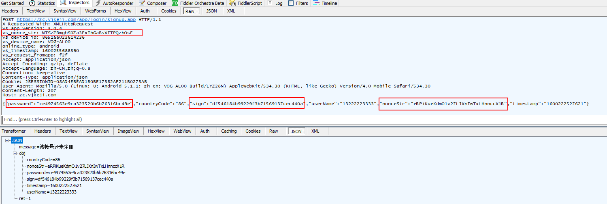

### 修改更新弹窗

一进来，又是强制更新，先改下弹窗。

位置在 UpAppUtils 里面的 showUpAppDialog 方法里。

有个参数是控制是否显示取消按钮的，将这个值固定传 1 就好了，就会显示取消按钮。

```smali
    :cond_0
    const/4 v1, 0x1

    goto :goto_0
.end method

```

原来是 0x0，改成 0X1 就好了，当然也可以改别的位置，都行。

这个 app 没有校验签名，倒是没啥问题。

### 抓取请求



分析这4个参数的由来。

#### vs_nonce_str

搜索这个字符串，比较显眼的是 MyOkHttp 类，开发过Android的就非常熟悉了，网络请求巨头。戳进去：

```java
params1.put("vs_nonce_str", ComUtil.getRandomString(32));
```

所以，它是随机出来的。nonce 也该也是一样。搞了这么多课，有没有想过，nonce 这个单词到底是啥意思！

### nonceStr

```java
params.put("nonceStr", ComUtil.getRandomString(32));
```

不用在意它又很多位置，只要看一个位置就好了，因为后台不太可能一个接口搞一套自己的规则，要知道程序员都TM懒。就算是多人开发，也很少有变化的，不然前端就要骂人了。

#### password

LoginActivity里面：

```java
        if (this.pwdMD5 == null) {
            String pwd = this.editPassword.getText().toString().trim();
            if (HyUtil.isEmpty(pwd)) {
                MyToast.show(this.context, this.editPassword.getHint().toString());
                return;
            } else if (pwd.length() < 6) {
                MyToast.show(this.context, getString(R.string.pwd_hint_prompt));
                return;
            } else {
                // 这里是密码加密
                this.pwdMD5 = MD5.md5Encode(MD5.md5Encode(pwd));
            }
        }
        
		AjaxParams params = new AjaxParams();
        params.put("countryCode", this.strCountryCode);
        params.put("userName", this.username);
		// 这里是密码加密
        params.put(com.vsf2f.f2f.ui.utils.Constant.PASSWORD, this.pwdMD5);
        params.put("timestamp", System.currentTimeMillis());
        params.put("nonceStr", ComUtil.getRandomString(32));
		// 这里是 sign 加密
        params.put("sign", ComUtil.encryptParam(params));
```

可以看到，密码是md5了两次，验证一下，是一样的。

#### sign 

上面的代码中，它是调用了  ComUtil.encryptParam

```java
    public static String encryptMap(Map<String, String> urlParams, boolean isPay) {
        if (urlParams == null) {
            return null;
        }
        List<String> paramsList = new ArrayList<>();
        for (Map.Entry<String, String> map : urlParams.entrySet()) {
            if (!TextUtils.isEmpty(map.getValue())) {
                // 将map中的key与value用  =  连接起来
                paramsList.add(map.getKey() + "=" + map.getValue());
            }
        }
        String[] strs = new String[paramsList.size()];
        paramsList.toArray(strs);
        // 排序
        Arrays.sort(strs);
        StringBuilder sb = new StringBuilder();
        int length = strs.length;
        // 拼接参数
        for (int i = 0; i < length; i++) {
            // a.b 是一个 & 号
            sb.append(strs[i] + a.b);
        }
        // 登录的时候，pay是false，走下面的一串
        if (isPay) {
            sb.append("key=09ebcc6549b6fad41e0b857459c5b2be");
        } else {
            sb.append("key=75cba6dd6d4d75154624dbe9d770d451");
        }
        // md5 加密
        try {
            return MD5.md5Encode(sb.toString());
        } catch (Exception e) {
            e.printStackTrace();
            return null;
        }
    }

```

所以最后就是：

```
countryCode=86&nonceStr=eRPiKueKdmO1v27LJXnIwTxLHnnccX1R&password=ce4974563e9ca323520b6b76316bc49e&timestamp=1600222527621&userName=13222223333&key=75cba6dd6d4d75154624dbe9d770d451
```

md5 后的值是一样的。