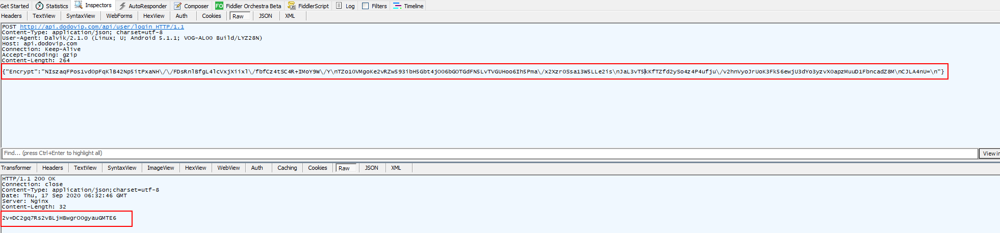

### 抓取登录请求



可以看到它的请求与返回结果都是加密的。

可以是一下点两次登录，看看加密串的结果，会发现两次请求的加密串前面有一部分是一样的，这就说明了，这个加密算法的特性是分组加密的，可以锁定范围为 DES/3DES/AES 这常见的3中，然后搜索看自己猜想的对不对。


### 寻找算法逻辑

```java
    private void login(String arg5, String arg6) {
        this.DEFAULT_TYPE = new TypeToken() {
        }.getType();
        this.para.clear();
        this.para.put("username", arg5);
        this.para.put("userPwd", arg6);
        if(TextUtils.isEmpty(DodonewOnlineApplication.devId)) {
            DodonewOnlineApplication.devId = Utils.getDevId(DodonewOnlineApplication.getAppContext());
        }

        this.para.put("equtype", "ANDROID");
        this.para.put("loginImei", "Android" + DodonewOnlineApplication.devId);
        this.requestNetwork("user/login", this.para, this.DEFAULT_TYPE);
    }
```

登录用到了如上的几个字段。

```java
    public void addRequestMap(Map arg9, int arg10) {
        HashMap v9;
        String v4 = System.currentTimeMillis() + "";
        if(arg9 == null) {
            v9 = new HashMap();
        }

        ((Map)v9).put("timeStamp", v4);
        // RequestUtil.paraMap 是将请求参数拼接起来，看源码还打印了log，tag是 yang，打开ddms可以看到
        // sign 参数无用
        // sdlkjsdljf0j2fsjk 的 key 的值
        String v2 = RequestUtil.encodeDesMap(RequestUtil.paraMap(((Map)v9), "sdlkjsdljf0j2fsjk", "sign"), this.desKey, this.desIV);
        JSONObject v3 = new JSONObject();
        try {
            v3.put("Encrypt", v2);
            this.mRequestBody = v3 + "";
        }
        catch(JSONException v1) {
            v1.printStackTrace();
        }
    }
```

又加上了时间戳。

```java
    private void InitCipher(byte[] arg9, byte[] arg10) throws Exception {
        MessageDigest v4 = MessageDigest.getInstance("MD5");
        // arg9 是 65102933
        v4.update(arg9);
        // v4 是 密钥的 md5 值，一般是 32 位，超过了 DES 的 8位，所以只取前面8位
        SecretKey v2 = SecretKeyFactory.getInstance("DES").generateSecret(new DESKeySpec(v4.digest()));
        // arg10 是 32028092，8位正常
        IvParameterSpec v5 = new IvParameterSpec(arg10);
        this.enCipher = Cipher.getInstance("DES/CBC/PKCS5Padding");
        this.deCipher = Cipher.getInstance("DES/CBC/PKCS5Padding");
        this.enCipher.init(1, ((Key)v2), ((AlgorithmParameterSpec)v5));
        this.deCipher.init(2, ((Key)v2), ((AlgorithmParameterSpec)v5));
    }
```

总的来说，还是一个挺简单的算法，就不验证了。