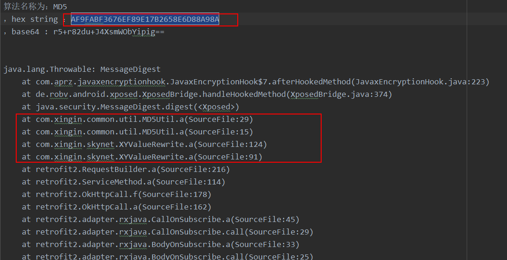

### 抓取请求


这里，我们看到，在登录小红书时，选择手机号登录，在提交短信验证码的时候，是一个 GET 请求，里面有一个 sign 值，我们使用上一课编写的模块，来打印一下相关信息。

### 查看输出log

我们编写的 xposed 模块，是将信息输出到应用目录下。记得先将需要 hook 的包名改成所有包名，这样就不用每次都重启了。

另外，一般我们的结果都需要转成二进制，或者进行base64编码，所以还要将输出的信息转一下，这样就可以直接搜索对应的字符串了。

重启，再次登录，查看输出日志信息：



我们直接搜索请求中的 sign 值（这里不同，是因为我点了很多次了），可以看到是有这个字符串的，而且 下面还很清晰的打印了调用堆栈，那么我们就直接去看 XYValueRewrite 这个类就好了。

查看相关源码位置：

```java
        HashMap hashMap = new HashMap();
        int size2 = list.size();
        for (int i2 = 0; i2 < size2; i2++) {
            hashMap.put(list.get(i2).f12952a, list.get(i2).b);
        }
        list.add(new RequestParam("sign", a(hashMap), false, z2));
```

可以看到， sign 的值是对一个 hashMap 进行操作，hashMap 的值根据上下文大致可以看出来就是GET请求的其余参数（因为后台要校验，所以肯定只有这些参数），我们看看 a 方法，是如何进行摘要的：

```java
    public static String a(Map<String, String> map) {
        if (map == null || map.isEmpty()) {
            return "";
        }
        String str = map.get("deviceId");
        ArrayList<String> arrayList = new ArrayList<>();
        arrayList.addAll(map.keySet());
        // 排序
        Collections.sort(arrayList);
        // 拼接
        StringBuilder sb = new StringBuilder();
        for (String str2 : arrayList) {
            sb.append(str2);
            sb.append(HttpUtils.EQUAL_SIGN);
            sb.append(map.get(str2));
        }
        // url 编码
        // 这个 urlencode 是自己实现的，所以需要 copy 出来
        byte[] bArr = new byte[1];
        try {
            bArr = URLEncoder.a(sb.toString(), "UTF-8").getBytes();
        } catch (UnsupportedEncodingException e2) {
            e2.printStackTrace();
        }
        byte[] bytes = str.getBytes();
        StringBuilder sb2 = new StringBuilder();
        int i = 0;
        // 这段可以直接进行代码copy
        for (byte b2 : bArr) {
            sb2.append(b2 ^ bytes[i]);
            i = (i + 1) % bytes.length;
        }
        // MD5Util.a 就是原生的 md5 摘要
        return MD5Util.a(MD5Util.a(sb2.toString()).toLowerCase() + str).toLowerCase();
    }

```

这样 sign 的逻辑就清晰了，下面进行算法还原，测试一下是否正确。

### 算法还原

```java
    public static String signXHS() {
        // zone=86
        // &phone=13284984984
        // &code=345636
        // &platform=Android
        // &deviceId=f1e0ca28-0c75-3572-a0d3-b75ff841c1ff
        // &device_fingerprint=202009211747532da8fc33f330466ee5df0fb3c6466fb4019981af5a89cd7e
        // &versionName=5.14.0
        // &channel=Store360
        // &lang=zh-CN
        // &t=1600695169
        // &sign=af9fabf3676ef89e17b2658e6d88a98a

        // 这里的 device_fingerprint 可能有点来头，不过这里就不分析了

        HashMap<String, String> hashMap = new HashMap<>();
        hashMap.put("zone", "86");
        hashMap.put("phone", "13284984984");
        hashMap.put("code", "345636");
        hashMap.put("platform", "Android");
        hashMap.put("deviceId", "f1e0ca28-0c75-3572-a0d3-b75ff841c1ff");
        hashMap.put("device_fingerprint", "202009211747532da8fc33f330466ee5df0fb3c6466fb4019981af5a89cd7e");
        hashMap.put("versionName", "5.14.0");
        hashMap.put("channel", "Store360");
        hashMap.put("lang", "zh-CN");
        hashMap.put("t", "1600695169");

        return a(hashMap);
    }
```

```java
    public static String a(Map<String, String> map) {
        if (map == null || map.isEmpty()) {
            return "";
        }
        String str = map.get("deviceId");
        ArrayList<String> arrayList = new ArrayList<>();
        arrayList.addAll(map.keySet());
        // 排序
        Collections.sort(arrayList);
        // 拼接
        StringBuilder sb = new StringBuilder();
        for (String str2 : arrayList) {
            sb.append(str2);
            sb.append("=");
            sb.append(map.get(str2));
        }
        // url 编码
        // 这个 urlencode 是自己实现的，所以需要 copy 出来
        byte[] bArr = new byte[0];
        try {
            bArr = URLEncoder.a(sb.toString(), "UTF-8").getBytes();
        } catch (UnsupportedEncodingException e2) {
            e2.printStackTrace();
        }
        byte[] bytes = str.getBytes();
        StringBuilder sb2 = new StringBuilder();
        int i = 0;
        // 这段可以直接进行代码copy
        for (byte b2 : bArr) {
            sb2.append(b2 ^ bytes[i]);
            i = (i + 1) % bytes.length;
        }
        // MD5Util.a 就是原生的 md5 摘要
        return md5(md5(sb2.toString()).toLowerCase() + str).toLowerCase();
    }
```

```java
package com.aprz;

import java.io.CharArrayWriter;
import java.io.UnsupportedEncodingException;
import java.nio.charset.Charset;
import java.nio.charset.IllegalCharsetNameException;
import java.nio.charset.UnsupportedCharsetException;
import java.util.BitSet;

public class URLEncoder {

    /* renamed from: a  reason: collision with root package name */
    static BitSet f7318a = new BitSet(256);

    static {
        for (int i = 97; i <= 122; i++) {
            f7318a.set(i);
        }
        for (int i2 = 65; i2 <= 90; i2++) {
            f7318a.set(i2);
        }
        for (int i3 = 48; i3 <= 57; i3++) {
            f7318a.set(i3);
        }
        f7318a.set(32);
        f7318a.set(45);
        f7318a.set(95);
        f7318a.set(46);
    }

    private URLEncoder() {
    }

    public static String a(String str, String str2) throws UnsupportedEncodingException {
        BitSet bitSet;
        char charAt;
        boolean z;
        char c;
        StringBuffer stringBuffer = new StringBuffer(str.length());
        CharArrayWriter charArrayWriter = new CharArrayWriter();
        if (str2 == null) {
            throw new NullPointerException("charsetName");
        }
        try {
            Charset forName = Charset.forName(str2);
            int i = 0;
            boolean z2 = false;
            while (i < str.length()) {
                char charAt2 = str.charAt(i);
                if (f7318a.get(charAt2)) {
                    if (charAt2 == ' ') {
                        c = '+';
                        z = true;
                    } else {
                        char c2 = charAt2;
                        z = z2;
                        c = c2;
                    }
                    stringBuffer.append((char) c);
                    i++;
                    z2 = z;
                } else {
                    do {
                        charArrayWriter.write(charAt2);
                        if (charAt2 >= 55296 && charAt2 <= 56319 && i + 1 < str.length() && (charAt = str.charAt(i + 1)) >= 56320 && charAt <= 57343) {
                            charArrayWriter.write(charAt);
                            i++;
                        }
                        i++;
                        if (i >= str.length()) {
                            break;
                        }
                        bitSet = f7318a;
                        charAt2 = str.charAt(i);
                    } while (!bitSet.get(charAt2));
                    charArrayWriter.flush();
                    byte[] bytes = new String(charArrayWriter.toCharArray()).getBytes(forName);
                    for (int i2 = 0; i2 < bytes.length; i2++) {
                        stringBuffer.append('%');
                        char forDigit = Character.forDigit((bytes[i2] >> 4) & 15, 16);
                        if (Character.isLetter(forDigit)) {
                            forDigit = (char) (forDigit - ' ');
                        }
                        stringBuffer.append(forDigit);
                        char forDigit2 = Character.forDigit(bytes[i2] & 15, 16);
                        if (Character.isLetter(forDigit2)) {
                            forDigit2 = (char) (forDigit2 - ' ');
                        }
                        stringBuffer.append(forDigit2);
                    }
                    charArrayWriter.reset();
                    z2 = true;
                }
            }
            return z2 ? stringBuffer.toString() : str;
        } catch (IllegalCharsetNameException e) {
            throw new UnsupportedEncodingException(str2);
        } catch (UnsupportedCharsetException e2) {
            throw new UnsupportedEncodingException(str2);
        }
    }

}
```

测试结果，与请求结果一致。